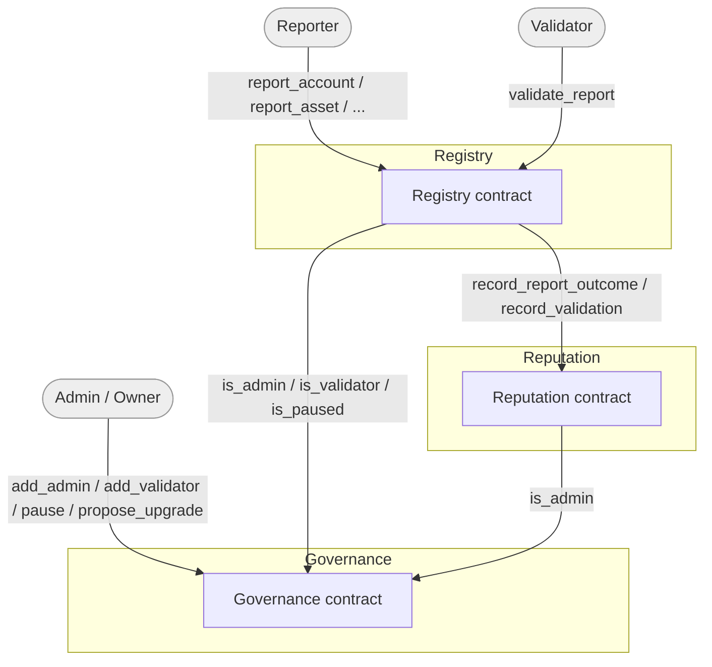

# Architecture

Three independently-deployed contracts, wired together by address rather than
by Rust-level coupling. Each can be upgraded or replaced without touching the
others' code, as long as the calling interface (function names + signatures)
stays stable.



## Why cross-contract calls, not one monolith

Splitting Registry, Reputation, and Governance into separate contracts (with
`common` holding only shared types and typed clients, no `#[contract]` of its
own) means:

- **Permissions live in one place.** Registry and Reputation never store
  their own admin/validator lists; they call
  `GovernanceClient::new(&env, &governance_address)` and ask. Adding a
  validator in Governance takes effect for the whole suite immediately.
- **Independent upgrade paths.** Each contract can be redeployed or migrated
  without redeploying the others, as long as it keeps implementing the
  function signatures the other contracts call (see `common::governance` and
  `common::reputation`, which define those signatures as plain traits).
- **Optional coupling.** The Registry works standalone (no reputation
  effects) until an admin calls `set_reputation_contract`. Nothing breaks if
  a deployment only wants Registry + Governance.

The cost is that every state-changing Registry/Reputation call makes at least
one cross-contract call to Governance for a permission check, which has a
real (small) fee/CPU cost on-chain. For this project's scale, that's a
reasonable trade for centralized, consistent permissions.

## How permission checks work

`contracts/common/src/governance.rs` declares:

```rust
#[contractclient(name = "GovernanceClient")]
pub trait GovernanceInterface {
    fn is_admin(env: Env, address: Address) -> bool;
    fn is_validator(env: Env, address: Address) -> bool;
    fn is_paused(env: Env) -> bool;
}
```

`#[contractclient]` generates `GovernanceClient`, a typed wrapper around
`env.invoke_contract`. The Governance contract's actual `#[contractimpl]`
implements functions with these exact names and signatures; Registry and
Reputation never depend on the `governance` crate itself, only on this
trait declaration in `common`. That keeps the dependency graph a DAG
(`registry`/`reputation` -> `common`, never -> each other or ->
`governance`) and lets any contract implementing the same interface stand in
for Governance.

## How the Registry -> Reputation callback is authorized

`record_report_outcome`/`record_validation` must only be callable by the
Registry contract that Reputation's admin configured via
`set_registry_contract`, not by an arbitrary caller who happens to know that
address. This relies on Soroban's **invoker-contract authorization**: when
contract A calls contract B, and B calls `a_address.require_auth()`, that
succeeds *without a signature* if and only if A is the direct, active caller
on the invocation stack -- a third party cannot forge this by simply passing
A's address as an argument, because the host checks who is actually invoking,
not what address was passed. See `contracts/reputation/src/lib.rs`'s
`require_registry` and the `soroban-env-host` `auth.rs` module for the
underlying mechanism.

## Storage layout

- **Governance**: everything (owner, admins, validators, pause flag, pending
  upgrade) lives in **instance storage** -- it's small and read on nearly
  every permission check, which is exactly what instance storage is for.
- **Registry**: the Governance/Reputation addresses and the report counter
  live in instance storage; individual `ScamReport`s, per-reporter history,
  and per-entity aggregate records (`AccountRecord`, `IssuerRecord`,
  `AssetRecord`) live in **persistent storage**, since the set of reports
  grows without bound.
- **Reputation**: Governance/Registry addresses in instance storage,
  per-account `ReputationProfile`s in persistent storage.

All persistent entries have their TTL extended on read and write; see the
`storage.rs` module in each contract.

## Data model

- `ScamReport` -- one filed report: entity, risk level, status, reporter,
  evidence URI, optional validator + notes, timestamps.
- `ReportedEntity` -- an enum carrying whichever data identifies the kind of
  entity being reported (`Account(Address)`, `AssetIssuer(Address)`,
  `Asset(code, issuer)`, `Domain(String)`, `Transaction(BytesN<32>)`).
- `AccountRecord` / `IssuerRecord` / `AssetRecord` -- aggregate stats
  (`EntityStats`: count, highest risk seen, latest status, timestamps) for
  the three entity kinds with rich enough traffic to warrant one. Domains and
  transactions currently only get duplicate-prevention + lookup, not a full
  aggregate record -- a natural first contribution (see the README's
  "Status" section).
- `Reporter` -- per-reporter activity counters kept by the Registry,
  independent of the score kept by Reputation.
- `ReputationProfile` -- score plus activity counters kept by Reputation.
- `Validator` / `PendingUpgrade` -- Governance's own bookkeeping.

## Roles

| Role | Set by | Can |
| --- | --- | --- |
| Owner | Deployed once at construction; transferable | Add/remove admins, execute upgrades |
| Admin | Owner | Add/remove validators, pause/unpause, propose/cancel upgrades, archive reports, manually reward/penalize reputation |
| Validator | Owner or Admin | Validate (approve/reject) reports |
| Reporter | Anyone (no registration) | File reports |
